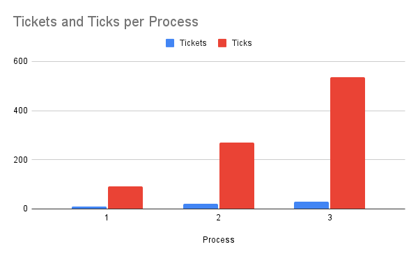

# Summary of Changes

Created 2 new system calls, `settickets` and `getpinfo`. Modified the kernel to implement a lottery scheduler.

### `src/sysproc.c`
Created intermediate functions for the system calls to parse the user arguments before passing to the kernel.
```c
int
sys_settickets(void)
{
  int n;

  if(argint(0, &n) < 0)
    return -1;
  return settickets(n);
}

int
sys_getpinfo(void)
{
  struct pstat* pst;
  if(argptr(0, (void*)&pst, sizeof(*pst)) < 0)
    return -1;
  return getpinfo(pst);
}
```

### `src/proc.h`
Implemented main functionality for the system calls. `settickets` gets the current process and updates the number of tickets assigned. `getpinfo` iterates through the process table to populate the `pstat` structure.
```c
int
settickets(int n)
{
  if (n < 1)
    return -1;  // non positive ticket counts are not allowed

  struct proc *curproc = myproc();
  curproc->tickets = n;

  return 0;
}

int
getpinfo(struct pstat* pst)
{
  struct proc* p;
  acquire(&ptable.lock);

  for(int i = 0; i < NPROC; i++)
  {
    p = &ptable.proc[i];
    pst->inuse[i] = (int)(p->state != UNUSED);
    pst->tickets[i] = p->tickets;
    pst->pid[i] = p->pid;
    pst->ticks[i] = p->ticks;
  }

  release(&ptable.lock);
  return 0;
}
```

Updated the scheduler function. Seeded the pseudo-random number generation based on the current time. The scheduler iterates through the process table and sums the number of tickets currently assigned to runable processes. A winning ticket is randomly generated, and the process table is iterated through again to find the process to be scheduled.
```c
void
scheduler(void)
{
  ...

  struct rtcdate rtc;
  cmostime(&rtc);
  // seed the lottery scheduler with the time
  srand(rtc.second);

  ...

  int total_tickets, winning_ticket, current_ticket;
  
  for(;;){
    // Enable interrupts on this processor.
    sti();

    // Loop over process table looking for process to run.
    acquire(&ptable.lock);

    // Count how many tickets have been given to running processes
    total_tickets = 0;
    for(p = ptable.proc; p < &ptable.proc[NPROC]; p++)
      if(p->state == RUNNABLE)
        total_tickets += p->tickets;

    if (total_tickets == 0)
      goto release;
    winning_ticket = (unsigned int)rand() % total_tickets;

    // Find the winning process
    current_ticket = 0;
    for(p = ptable.proc; p < &ptable.proc[NPROC]; p++){
      if(p->state != RUNNABLE)
        continue;

      current_ticket += p->tickets;
      if (winning_ticket >= current_ticket)
        continue;

      // Switch to chosen process.  It is the process's job
      // to release ptable.lock and then reacquire it
      // before jumping back to us.
      c->proc = p;
      switchuvm(p);
      p->state = RUNNING;
      p->ticks++;

      swtch(&(c->scheduler), p->context);
      switchkvm();

      // Process is done running for now.
      // It should have changed its p->state before coming back.
      c->proc = 0;
    }

release:
    release(&ptable.lock);

  }
}
```

### `src/ps.c`
Created a user program that uses the `getpinfo` system call to print information about the current running processes.
```c
#include "types.h"
#include "param.h"
#include "pstat.h"
#include "user.h"


void
ps(struct pstat* pst)
{
    getpinfo(pst);
    printf(1, "%s\t%s\t%s\n", "PID", "TICKETS", "TICKS");
    for (int i = 0; i < NPROC; i++)
    {
        if (pst->inuse[i])
        {
            printf(1, "%d\t%d\t%d\n", pst->pid[i], pst->tickets[i], pst->ticks[i]);
        }
    }
}

int
main(int argc, char *argv[])
{
    struct pstat pst;
    ps(&pst);
    exit();
}
```

### `src/scheduler_test.c`
Created a simple user program that forks 3 dummy processes with different ticket quantities. Can be used in combination with `ps` to demonstrate functionality of the scheduler.
```c
#include "types.h"
#include "stat.h"
#include "user.h"


int main(void)
{
    int rc, tickets;
    settickets(100);  // give the parent priority while forking dummy tasks

    for (int i = 0; i < 3; i++)
    {
        rc = fork();
        tickets = (i + 1) * 10;
        if (rc == 0)
        {
            settickets(tickets);
            for(;;);
        }
        else
        {
            printf(1, "Spawned pid #%d with %d tickets\n", rc, tickets);
        }
    }

    exit();
}
```

### Results
Running `scheduler_test` to spawn 3 processes with 10, 20 and 30 tickets:
```
Booting from Hard Disk..xv6...
cpu0: starting 0
sb: size 1000 nblocks 941 ninodes 200 nlog 30 logstart 2 inodestart 32 bmap start 58
init: starting sh
$ scheduler_test
Spawned pid #4 with 10 tickets
Spawned pid #5 with 20 tickets
Spawned pid #6 with 30 tickets
$ ps
PID     TICKETS TICKS
1       1       26
2       1       20
7       1       7
4       10      93
5       20      271
6       30      536
```


As shown by the graph, the number of ticks each process is scheduled for scales linearly with the number of tickets assigned. The exact distribution varies quite significantly due to the quality of pseudo-random number generation.

### Areas for improvement

The implementation used for pseudo-random number generation is far from ideal, as well as the method for seeding. These should be revised to more evenly distribute the winning tickets and improve kernel security.
